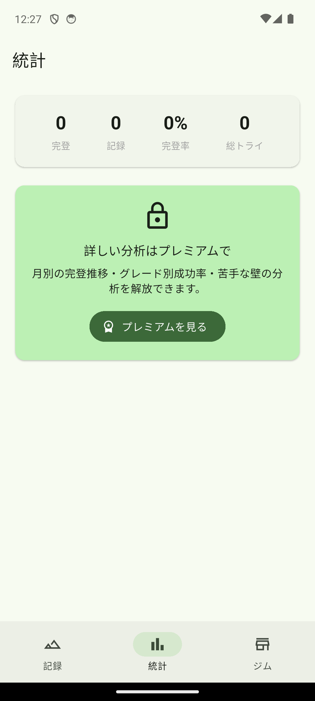
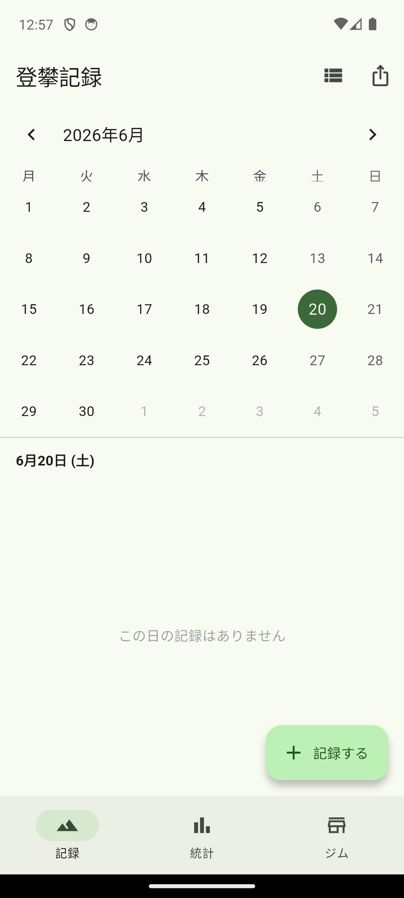

# Climb Log 🧗

ボルダリングの登攀をかんたんに記録・分析できる Flutter アプリ（iOS / Android）。
通うジムごとに課題を記録し、完登率や苦手な壁を見える化して上達につなげます。

<p>
  
  
  
</p>

## 主な機能

- **登攀記録** — ジム / グレード / 壁の種類 / トライ数 / 完登 / 写真（複数枚）/ ベータメモ
- **一覧 & カレンダー** — 日付グループのリストと月カレンダーを切り替え
- **統計ダッシュボード**（プレミアム）— 月別完登数・グレード別/壁別の完登率
- **CSVエクスポート**（プレミアム）— バックアップ・共有
- **オフライン動作** — データは端末内（SQLite）に保存

## 技術スタック

| 領域 | 採用 |
|---|---|
| 状態管理 | Riverpod |
| DB | Drift（SQLite, 外部キー制約 ON） |
| 課金 | RevenueCat（`purchases_flutter`） |
| カレンダー | table_calendar |
| 画像 | image_picker |

## セットアップ

```bash
flutter pub get

# Drift などのコード生成（*.g.dart はコミット済みのため通常は不要）
dart run build_runner build

# 実行
flutter run
```

### 課金（プレミアム）を有効化する

API キーはソースに含めず、ビルド時に注入します。

```bash
flutter run \
  --dart-define=RC_IOS_KEY=appl_xxxxxxxx \
  --dart-define=RC_ANDROID_KEY=goog_xxxxxxxx
```

キー未設定でもアプリは動作します（プレミアム機能はロック）。設定手順は
[`docs/revenuecat_setup.md`](docs/revenuecat_setup.md) を参照。

## プロジェクト構成

```
lib/
├─ data/        Drift DB・写真保存・CSVエクスポート
├─ premium/     RevenueCat ラッパ
├─ stats/       統計の計算ロジック（テスト対象）
├─ screens/     画面（記録・統計・ジム・課金・ビューア）
├─ providers.dart
└─ main.dart
tool/generate_icon.dart   アプリアイコン生成
docs/                     ストア掲載文・プライバシーポリシー・リリース手順
```

## 開発

```bash
flutter analyze
flutter test
dart format lib test
```

push / PR ごとに GitHub Actions で analyze・test・format を実行します。

## リリース

[`docs/release_checklist.md`](docs/release_checklist.md) を参照。
ストア掲載文は [`docs/store_listing.md`](docs/store_listing.md)。

## ライセンス

個人プロジェクト。権利はすべて作者に帰属します。
